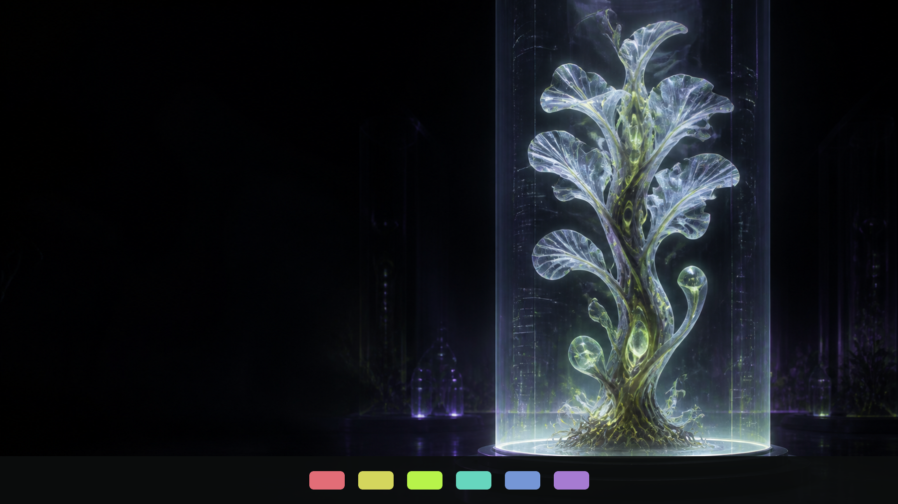

# Xenobotany Lab No. 7

An original dark Omarchy theme for a clandestine alien greenhouse: near-black glass, ultraviolet shadows, and radioactive botanical green.



## Install

```bash
omarchy theme install https://github.com/leaflessbranch/omarchy-xenobotany-lab-no-7-theme.git
```

Switch between the two included wallpapers with `omarchy theme bg next`. Update all Git-installed themes with `omarchy theme update`, or remove this one with `omarchy theme remove xenobotany-lab-no-7`.

Requires a current Omarchy installation. Developed and tested with Omarchy 4.0.0-1.

## Included

- Complete dark palette generated through `colors.toml`
- Two original 16:9 wallpapers
- Coordinated Omarchy lock-screen colors
- Transparent Plymouth unlock emblem and preview
- `Yaru-olive-dark` icon selection

Part of [Omarchy Dreamscapes](https://github.com/leaflessbranch/omarchy-dreamscapes), a ten-theme surreal desktop collection.

## License and provenance

Theme configuration is released under the MIT License. The original wallpapers were generated with OpenAI image generation and curated by Eddie ([leaflessbranch](https://github.com/leaflessbranch)); see [WALLPAPERS.md](WALLPAPERS.md).
